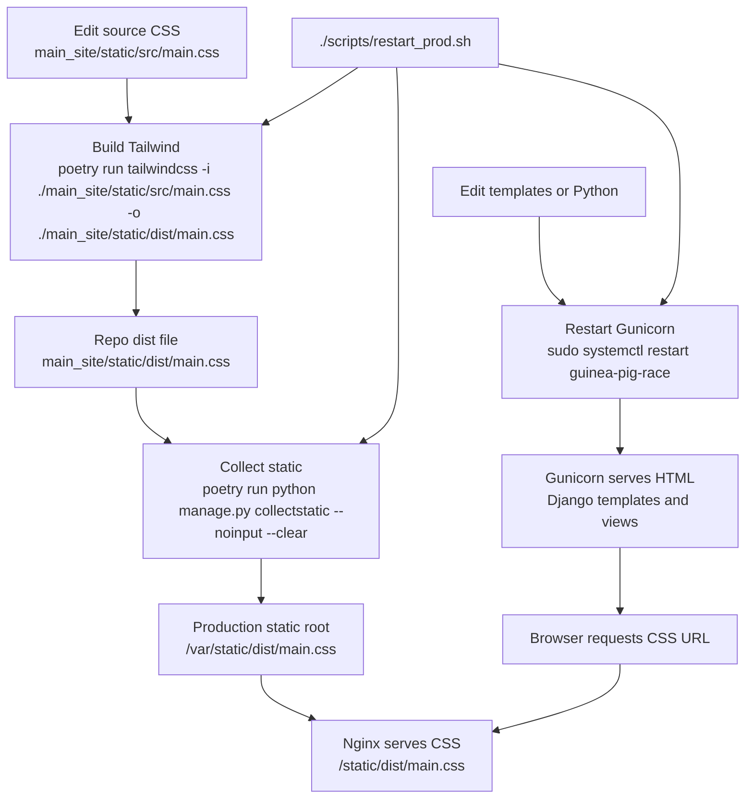

# The Guinea Pig Mile

Welcome to The Guinea Pig Mile. 4 laps. 1609 meters. A race so beautiful it’ll make you believe in a higher power, and so painful it’ll make you pray to one.

## Running this App in Development

Install Python dependencies:

```sh
poetry install
```

Create a local `.env` file with the settings Django expects:

```sh
PRODUCTION=false
SECRET_KEY=replace-me
ALLOWED_HOSTS=localhost,127.0.0.1
CSRF_TRUSTED_ORIGINS=http://localhost:8000,http://127.0.0.1:8000
```

Set up the database:

```sh
poetry run python manage.py migrate
poetry run python manage.py seed
```

Start Tailwind in one terminal:

```sh
poetry run ./scripts/tailwind.sh
```

Start Django in another terminal:

```sh
poetry run python manage.py runserver
```

Visit the app at `http://localhost:8000`.

### Running with Docker Compose

Build and start the development server:

```sh
docker compose up --build
```

The app will be available at `http://localhost:8000`. Compose bind-mounts the project into the container, runs migrations on startup, starts Tailwind in watch mode, and starts Django on `0.0.0.0:8000`.

To also run the seed command on startup, set `SEED_DATABASE=true`:

```sh
SEED_DATABASE=true docker compose up --build
```

## Seeding Data

```sh
poetry run python manage.py seed
```

## Installing Dependencies

Add Python dependencies with Poetry:

```sh
poetry add package-name
```

## Running this App in Production

Production runs directly on the Lightsail server with Gunicorn behind Nginx. The app does not require Docker.

Install system dependencies:

```sh
sudo apt update
sudo apt install -y python3 python3-pip python3-venv sqlite3 nginx
python3 -m pip install --user poetry
```

From the project directory, install Python dependencies:

```sh
poetry install --no-root
```

Create a `.env` file with production values:

```sh
PRODUCTION=true
SECRET_KEY=replace-me
ALLOWED_HOSTS=your-domain.com
CSRF_TRUSTED_ORIGINS=https://your-domain.com
```

Prepare the database and static files:

```sh
poetry run python manage.py migrate
sudo mkdir -p /var/static
sudo chown -R "$USER":www-data /var/static
poetry run python manage.py collectstatic --noinput
```

After deploying CSS, template, or Python changes, rebuild static files and restart
Gunicorn:

```sh
./scripts/restart_prod.sh
```

To pull the latest git changes first:

```sh
./scripts/restart_prod.sh --pull
```

Static assets flow through two separate locations: the repo build output and
the directory Nginx serves in production.



If the site is serving stale CSS, check `/var/static/dist/main.css`, not only
`main_site/static/dist/main.css`. Nginx serves the `/var/static` copy directly;
Gunicorn only serves the HTML that links to it.

Start the app server with Gunicorn:

```sh
./scripts/start.sh
```

For a persistent production process, run Gunicorn with `systemd`. Create `/etc/systemd/system/guinea-pig-race.service`:

```ini
[Unit]
Description=Guinea Pig Race
After=network.target

[Service]
Type=simple
User=ubuntu
WorkingDirectory=/home/ubuntu/guinea-pig-race
ExecStart=/home/ubuntu/.local/bin/poetry run gunicorn race_site.wsgi:application --bind 127.0.0.1:8000
Restart=always

[Install]
WantedBy=multi-user.target
```

Update `User`, `WorkingDirectory`, and the Poetry path if your server uses different values.

Enable and start the service:

```sh
sudo systemctl daemon-reload
sudo systemctl enable guinea-pig-race
sudo systemctl start guinea-pig-race
sudo systemctl status guinea-pig-race
```

Configure Nginx to serve static files from `/var/static` and proxy app traffic to Gunicorn at `127.0.0.1:8000`. The included `nginx-app.conf` is the project template. After changing the domain name, install it and reload Nginx:

```sh
sudo cp nginx-app.conf /etc/nginx/nginx.conf
sudo nginx -t
sudo systemctl reload nginx
```
